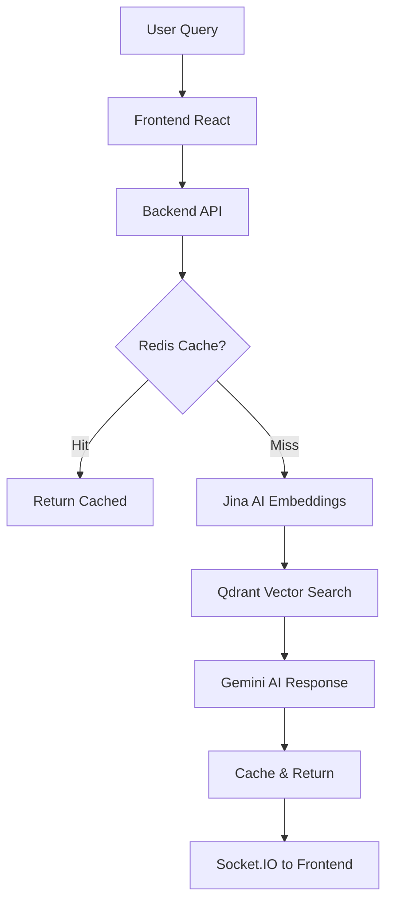
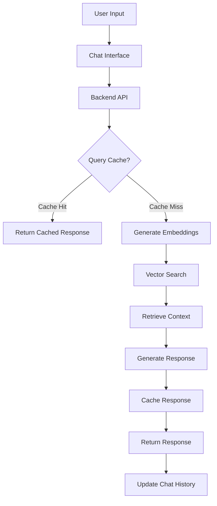
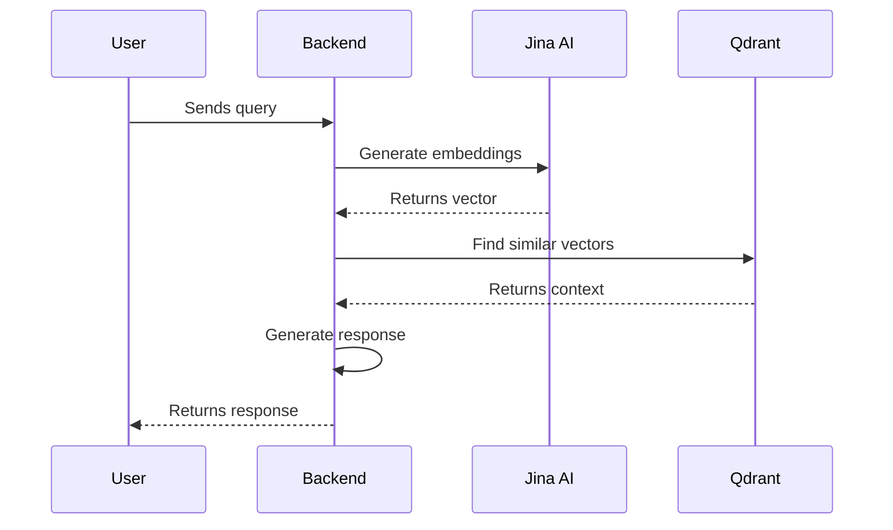
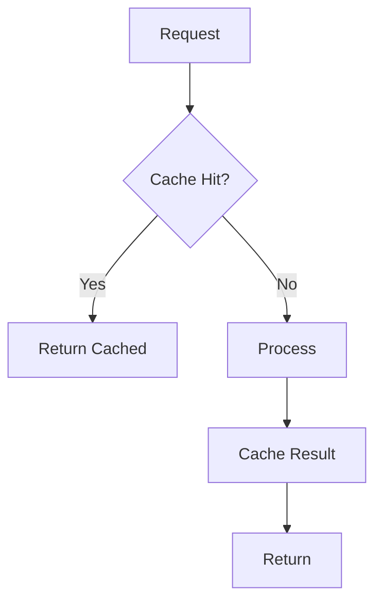

# RAG Chatbot: Technical Interview Guide 🎯

> Complete technical guide for understanding and explaining the RAG chatbot architecture in interviews.

## 🚀 System at a Glance
- **Stack**: Node.js + React + Redis + Qdrant + Jina AI
- **Architecture**: Microservices with fallback mechanisms
- **Real-time**: Socket.IO for live chat
- **Caching**: Multi-layer (Redis + In-memory)
- **Vector Search**: 768D embeddings with HNSW indexing

## 📋 Contents
1. [Quick Architecture](#quick-architecture)
2. [Interview Questions & Answers](#interview-questions--answers)
3. [Technical Deep Dive](#technical-deep-dive)
4. [System Design Decisions](#system-design-decisions)
5. [Performance & Monitoring](#performance--monitoring)

## ⚡ Quick Architecture



**Flow Summary**: Query → Cache Check → Embeddings → Vector Search → AI Response → Cache → Real-time Update



## 🎯 Interview Questions & Answers

### 🔍 **Embeddings & Vector Search**

**Q1: How are embeddings created, indexed, and stored?**

**Creation Process:**
```javascript
// 1. Text Preprocessing
const cleanText = text.replace(/[^\w\s]/gi, '').toLowerCase();

// 2. Jina AI API Call
const response = await axios.post('https://api.jina.ai/v1/embeddings', {
  model: 'jina-embeddings-v2-base-en',
  input: [cleanText]
});

// 3. Extract 768D Vector
const embedding = response.data.data[0].embedding;
```

**Indexing & Storage:**
- **Qdrant Collection**: `news_articles` with 768 dimensions
- **Index Type**: HNSW (Hierarchical Navigable Small World)
- **Distance Metric**: Cosine similarity
- **Metadata**: Article title, content, timestamp, category

**Q2: How do you handle embedding failures?**
```javascript
// Fallback mechanism
if (!jinaApiKey || apiError) {
  return generateFallbackEmbedding(text); // Simple hash-based vector
}
```

**Q3: How would you improve embedding quality?**
- **Domain-specific fine-tuning** on news data
- **Hybrid search**: Combine BM25 + vector search
- **Dynamic chunking** based on content type
- **Metadata filtering** for better relevance

---

### 💾 **Redis Caching & Session Management**

**Q4: How does Redis caching work in your system?**

**Cache Structure:**
```javascript
// Query Cache (30 min TTL)
const cacheKey = `query:${Buffer.from(query).toString('base64')}`;
await redis.setex(cacheKey, 1800, JSON.stringify(response));

// Session Storage (30 day TTL)
await redis.hset(`session:${sessionId}`, {
  createdAt: Date.now(),
  lastActivity: Date.now(),
  messageCount: 1
});

// Chat History (30 day TTL)
await redis.rpush(`chat:${sessionId}:messages`, JSON.stringify(message));
```

**Q5: What happens when Redis is down?**
```javascript
class RedisClient {
  constructor() {
    this.fallbackMode = false;
    this.inMemoryStore = new Map();
  }
  
  async get(key) {
    if (this.fallbackMode) {
      return this.inMemoryStore.get(key);
    }
    try {
      return await this.client.get(key);
    } catch (error) {
      this.fallbackMode = true;
      return this.inMemoryStore.get(key);
    }
  }
}
```

**Q6: How do you optimize Redis performance?**
- **Connection pooling** for multiple clients
- **Pipeline operations** for batch commands
- **Appropriate TTL** values to prevent memory bloat
- **Memory monitoring** and eviction policies

---

### 🌐 **Frontend API/Socket Integration**

**Q7: How does the frontend handle API calls and Socket.IO?**

**Initial Setup:**
```javascript
// Socket.IO Connection
const socket = io('http://localhost:3001');

// API Service
class ChatService {
  static async sendMessage(message, sessionId) {
    return axios.post('/api/chat', { message, sessionId });
  }
}
```

**Real-time Flow:**
```javascript
// 1. User sends message
const handleSendMessage = async (message) => {
  // Optimistic update
  setMessages(prev => [...prev, { role: 'user', content: message }]);
  
  // Emit to server
  socket.emit('chat_message', { message, sessionId });
};

// 2. Listen for responses
socket.on('chat_response', (data) => {
  setMessages(prev => [...prev, {
    role: 'assistant',
    content: data.response,
    sources: data.sources
  }]);
});

// 3. Handle typing indicators
socket.on('typing', () => setIsTyping(true));
socket.on('stop_typing', () => setIsTyping(false));
```

**Q8: How do you handle connection failures?**
```javascript
// Reconnection Logic
socket.on('disconnect', () => {
  setConnectionStatus('disconnected');
  // Queue messages locally
  queueMessage(message);
});

socket.on('connect', () => {
  setConnectionStatus('connected');
  // Send queued messages
  flushMessageQueue();
});
```

**Q9: State management strategy?**
```javascript
// Context API for global state
const ChatContext = createContext();

const ChatProvider = ({ children }) => {
  const [messages, setMessages] = useState([]);
  const [session, setSession] = useState(null);
  const [isTyping, setIsTyping] = useState(false);
  
  return (
    <ChatContext.Provider value={{
      messages, setMessages,
      session, setSession,
      isTyping, setIsTyping
    }}>
      {children}
    </ChatContext.Provider>
  );
};
```

---

### 🏗️ **System Design Decisions**

**Q10: Why did you choose this architecture?**

**Key Decisions:**
1. **Microservices Pattern**: Each service (embedding, vector, cache) is independent
2. **Stateless Design**: Easy horizontal scaling
3. **Graceful Degradation**: Fallback mechanisms for each component
4. **Real-time Communication**: Socket.IO for better UX

**Q11: What are the trade-offs?**

| Decision | Pros | Cons |
|----------|------|------|
| Jina AI | Free tier, good quality | API dependency |
| Redis | Fast, persistent | Single point of failure |
| Socket.IO | Real-time, reliable | Connection overhead |
| Microservices | Scalable, maintainable | Complex deployment |

**Q12: How would you scale this system?**

**Horizontal Scaling:**
```javascript
// Load balancer configuration
const cluster = require('cluster');
const numCPUs = require('os').cpus().length;

if (cluster.isMaster) {
  for (let i = 0; i < numCPUs; i++) {
    cluster.fork();
  }
} else {
  require('./server.js');
}
```

**Database Scaling:**
- **Redis Cluster**: Sharding across multiple nodes
- **Qdrant Sharding**: Distribute vectors across instances
- **Read Replicas**: For high-read workloads

**Q13: Security considerations?**
- **Rate limiting**: Prevent API abuse
- **Input sanitization**: Prevent injection attacks
- **API key rotation**: Regular credential updates
- **CORS configuration**: Restrict origins
- **Session validation**: Prevent session hijacking

---

### 🚀 **Advanced Questions**

**Q14: How do you handle concurrent users?**
```javascript
// Session isolation
class SessionManager {
  static async createSession() {
    const sessionId = uuidv4();
    await redis.hset(`session:${sessionId}`, {
      createdAt: Date.now(),
      active: true
    });
    return sessionId;
  }
  
  static async getUserSessions(userId) {
    const keys = await redis.keys(`session:${userId}:*`);
    return Promise.all(keys.map(key => redis.hgetall(key)));
  }
}
```

**Q15: Monitoring and observability?**
```javascript
// Health check endpoint
app.get('/health', async (req, res) => {
  const health = {
    redis: await checkRedisHealth(),
    qdrant: await checkQdrantHealth(),
    jinaAI: await checkJinaHealth(),
    uptime: process.uptime()
  };
  
  res.json(health);
});

// Metrics collection
const prometheus = require('prom-client');
const httpRequestDuration = new prometheus.Histogram({
  name: 'http_request_duration_seconds',
  help: 'Duration of HTTP requests in seconds'
});
```

**Q16: Error handling strategy?**
```javascript
// Circuit breaker pattern
class CircuitBreaker {
  constructor(threshold = 5, timeout = 60000) {
    this.failureCount = 0;
    this.threshold = threshold;
    this.timeout = timeout;
    this.state = 'CLOSED'; // CLOSED, OPEN, HALF_OPEN
  }
  
  async call(fn) {
    if (this.state === 'OPEN') {
      throw new Error('Circuit breaker is OPEN');
    }
    
    try {
      const result = await fn();
      this.onSuccess();
      return result;
    } catch (error) {
      this.onFailure();
      throw error;
    }
  }
}
```

## 💡 Interview Q&A

### 1. Embeddings & Vector Search
**Q: How are embeddings created and used?**
- **Creation**: Text → Jina AI API → 768D vector
- **Indexing**: Stored in Qdrant with HNSW index
- **Search**: Cosine similarity for context retrieval
- **Optimization**: Batch processing and caching

**Q: How would you improve embedding quality?**
- Fine-tune on domain-specific data
- Implement dynamic chunking
- Add metadata filtering
- Hybrid search (BM25 + vector)

### 2. Redis Implementation
**Q: How does Redis handle caching?**
- **Query Cache**: 30-min TTL
- **Session Store**: 30-day TTL
- **Fallback**: In-memory store
- **Pipelining**: For batch operations

**Q: How would you scale Redis?**
- Redis Cluster for sharding
- Read replicas
- Cache warming
- Local cache fallback

### 3. Frontend Integration
**Q: How does the frontend handle real-time updates?**
- **Initial Load**: REST API
- **Real-time**: Socket.IO
- **State Management**: React context
- **Optimistic Updates**: For better UX

**Q: How do you handle offline mode?**
- Service workers
- Local storage for messages
- Queue for sync
- Conflict resolution

### 4. System Design
**Q: Key design decisions?**
1. **Modular Services**: Independent scaling
2. **Hybrid Search**: Better relevance
3. **Graceful Degradation**: Fallback mechanisms
4. **Stateless Design**: Easier scaling

**Q: Potential improvements?**
- Rate limiting
- A/B testing
- Multi-modal support
- Edge caching

## 🏗️ System Components

### 1. Embedding Service
- Jina AI integration
- Batch processing
- Error handling
- Fallback mechanism

### 2. Vector Store (Qdrant)
- HNSW index
- Payload filtering
- Sharding support
- Hybrid search

### 3. Redis Layer
```mermaid
classDiagram
    class RedisClient {
        +cacheQuery()
        +getChatHistory()
        +updateSession()
        +healthCheck()
    }
    
    class FallbackStore {
        +inMemoryCache
        +persistToDisk()
    }
    
    RedisClient --> FallbackStore : falls back to

### Data Structure Overview

| Data Type | Key Pattern | Purpose | TTL |
|-----------|-------------|---------|-----|
| List | `chat:{sessionId}:messages` | Stores chat history | 30 days |
| Hash | `session:{sessionId}` | Session metadata | 30 days |
| String | `query:{hash}` | Cached query results | 30 minutes |

### Key Operations

```javascript
// Storing a message
await redis.rpush(`chat:${sessionId}:messages`, JSON.stringify(message));

// Getting chat history
const messages = await redis.lrange(`chat:${sessionId}:messages`, 0, -1);

// Caching a query result
const cacheKey = `query:${Buffer.from(query).toString('base64')}`;
await redis.setex(cacheKey, 1800, JSON.stringify(result));
```

## Embeddings & Vector Search

### Jina AI Embeddings
- **Model**: `jina-embeddings-v2-base-en`
- **Dimensions**: 768
- **Batch Processing**: Yes
- **Fallback**: Local embedding generation



## Caching Strategy

### Query Cache (TTL: 30 minutes)
- **Key**: `query:{base64_encoded_query}`
- **Purpose**: Avoid reprocessing identical queries
- **Cache Miss**: `Query Cache: 0`
- **Cache Hit**: `Query Cache: 1`

### Implementation
```javascript
async function getCachedResponse(query) {
  const cacheKey = `query:${Buffer.from(query).toString('base64')}`;
  const cached = await redis.get(cacheKey);
  
  if (cached) {
    console.log('Query Cache: 1');
    return JSON.parse(cached);
  }
  
  console.log('Query Cache: 0');
  const result = await processQuery(query);
  await redis.setex(cacheKey, 1800, JSON.stringify(result));
  return result;
}
```

## Session Management

### Session Data Structure
```json
{
  "sessionId": "abc123",
  "createdAt": "2025-09-17T15:00:00Z",
  "lastActivity": "2025-09-17T15:30:00Z",
  "messageCount": 5,
  "userPreferences": {}
}
```

### Session Operations
- **Create Session**: `HSET session:{id} createdAt {timestamp}`
- **Update Activity**: `HSET session:{id} lastActivity {now} messageCount {count}`
- **Get Session**: `HGETALL session:{id}`

## 🚀 Performance & Scaling

### Caching Strategy


### Scaling Approaches
1. **Horizontal Scaling**: Stateless services
2. **Read Replicas**: For Redis/Qdrant
3. **Connection Pooling**: Database connections
4. **CDN**: Static assets

## 📊 Monitoring & Operations

### Key Metrics
| Metric | Tool | Alert Threshold |
|--------|------|-----------------|
| Latency | Prometheus | >500ms |
| Error Rate | Grafana | >1% |
| Cache Hit Ratio | Redis CLI | <80% |
| Memory Usage | Upstash | >80% |

### Useful Commands
```bash
# Check Redis memory
redis-cli info memory

# Monitor Qdrant
curl http://qdrant:6333/metrics

# Check service health
curl -X GET /health
```

## 🛠️ Development Setup

### Environment Variables
```env
# Jina AI
JINA_API_KEY=your_key

# Redis
REDIS_URL=redis://localhost:6379

# Qdrant
QDRANT_URL=http://localhost:6333
```

### Running Locally
```bash
# Start services
docker-compose up -d

# Run tests
npm test

# Monitor
npm run dev:monitor
```

## 📚 Learning Resources
- [Jina AI Docs](https://docs.jina.ai/)
- [Qdrant Guide](https://qdrant.tech/documentation/)
- [Redis Best Practices](https://redis.io/docs/manual/patterns/)
- [WebSocket Patterns](https://developer.mozilla.org/en-US/docs/Web/API/WebSockets_API)

### Upstash Dashboard

#### Key Metrics
1. **Commands**
   - Total operations (GET, SET, HSET, etc.)
   - Command rate over time
   
2. **Bandwidth**
   - Data transfer in/out
   - Connection patterns

3. **Storage**
   - Total data size
   - Key distribution
   - Memory usage

#### Useful CLI Commands
```bash
# List all keys
KEYS *

# Get chat message count
LLEN chat:session_abc123:messages

# View session data
HGETALL session:abc123

# Check memory usage
MEMORY USAGE chat:session_abc123:messages
```

### Health Checks
- **Redis Connection**: `PING`
- **Storage Health**: `INFO memory`
- **Replication Status**: `INFO replication`

## Best Practices

1. **Cache Invalidation**
   - Use appropriate TTL values
   - Invalidate cache on data updates

2. **Error Handling**
   - Fallback to in-memory store
   - Graceful degradation
   - Circuit breaker pattern

3. **Performance**
   - Pipeline related commands
   - Use appropriate data structures
   - Monitor slow queries

## Troubleshooting

### Common Issues
1. **High Command Count**
   - Check for redundant operations
   - Implement command batching

2. **Cache Misses**
   - Review TTL settings
   - Check cache key generation

3. **Connection Issues**
   - Verify network connectivity
   - Check Redis server status

## Resources
- [Redis Documentation](https://redis.io/documentation)
- [Jina AI Embeddings](https://jina.ai/embeddings/)
- [Qdrant Vector Search](https://qdrant.tech/documentation/)
